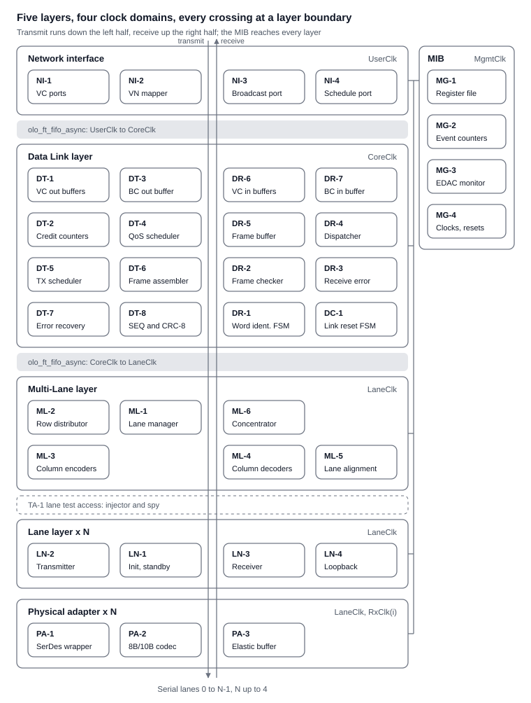

# OpenFibre Architecture

Version 0.1, 2026-10-04. This file is the reference for the architecture and is versioned with the code.

## 1 Purpose, scope and references

This document defines the architecture of OpenFibre, a fully featured SpaceFibre IP core. Together with
ECSS-E-ST-50-11C it is the complete basis for an implementation: it fixes the building blocks, their interfaces, the
ECSS requirements each block owns and the Open Logic entities each block is built from. It contains no code.

### In scope

- Physical layer adaptation: serialiser/deserialiser (SerDes) abstraction, loss of signal, serial loopback control.
- Lane layer, one instance per lane.
- Multi-Lane layer with 1 to 4 lanes (ECSS allows up to 16; 4 decided on 2026-09-30), including asymmetric links,
  unidirectional lanes and hot redundant lanes.
- Data Link layer with all features: up to 32 virtual channels, all quality of service (QoS) mechanisms, broadcast,
  scrambling, error recovery, link reset.
- Network layer service interface of a SpaceFibre node (packet and broadcast message transfer, optional virtual network
  mapping).
- Management Information Base (MIB) and its register interface.
- Clocking, reset, fault tolerance and the verification architecture.

### Out of scope

- The routing switch, path and logical addressing and group adaptive routing (ECSS 5.8.8 to 5.8.11). OpenFibre has no
  routing switch (decided on 2026-10-04).
- Electrical and optical media, connectors and cables (ECSS 5.4.3 to 5.4.6). They are properties of the transceiver and
  the board.

### Target device

The first supported target (decided on 2026-09-30) is the AMD Versal AI Core XCVC1902 (part xcvc1902-vsva2197-2MP-e-S)
on the VCK190 evaluation board, with the 4 lanes on GTY transceivers routed to the QSFP connector of the board. Further
devices and boards are added through a new Physical adapter (PA-1) and board constraints only; nothing above the
Physical adapter depends on the target (section 7.6).

### Project

OpenFibre is an open SpaceFibre implementation that is based on the Open Logic VHDL Library. The code lives in
[rustyqt/openfibre](https://github.com/rustyqt/openfibre) under the PSI HDL Library License, Version 1.0, the licence of
Open Logic. Open Logic is pinned to the head of `feature/fault-tolerant-all-entities` of rustyqt/open-logic (4990f33e,
2026-09-30). The line rate is 6.25 Gbit/s per lane. All four points were decided on 2026-10-04.

### References

| ID | Document | Version used |
| --- | --- | --- |
| \[ECSS\] | ECSS-E-ST-50-11C, SpaceFibre: very high-speed serial link | 15 May 2019 |
| \[OLO\] | [Open Logic, branch feature/fault-tolerant-all-entities](https://github.com/rustyqt/open-logic/tree/feature/fault-tolerant-all-entities) | 4990f33e (2026-09-30) |

### Conventions

- Requirement references are ECSS clause numbers with the requirement letter, for example ECSS 5.7.7.1a. A range such as
  5.7.7.2.1 to 5.7.7.2.4 means all requirements of those clauses.
- Coding conventions: those of Open Logic (naming, two-process style, synchronous high-active resets, VSG rules), entity
  prefix `ofb_`, VHDL library `openfibre`; see [conventions.md](conventions.md).
- "FT" (fault-tolerant) means the Open Logic `olo_ft_*` entities: SECDED ECC on every RAM, TMR on every clock domain
  crossing.

| Term | Meaning |
| --- | --- |
| VC | Virtual channel (ECSS 5.7.2) |
| FCT | Flow control token (ECSS 5.3.5.2) |
| ERB | Error recovery buffer (ECSS 5.7.7.1) |
| MAC | Medium access controller (ECSS 5.7.4) |
| N-Char | Data character or EOP / EEP of a packet (ECSS 5.3.7.1) |
| SEU | Single event upset |

## 2 SpaceFibre functional overview

A fully featured SpaceFibre port implements five protocol layers and a management information base (ECSS 5.2).
OpenFibre covers every row of the table below except the routing switch, with the Multi-Lane layer limited to 4 lanes.

| Layer | Function | ECSS clauses |
| --- | --- | --- |
| Network | Packet transfer of a node: packet format, sending, receiving | 5.8.5 to 5.8.7, 6.2.2 |
| Network | Virtual networks: mapping of virtual networks to VCs | 5.8.3 |
| Network | Broadcast messages, broadcast channels | 5.8.12, 6.2.3 |
| Network | Routing switch, addressing, group adaptive routing, multicast | 5.8.8 to 5.8.11 |
| Data Link | Virtual channels, output and input VC buffers, up to 32 VCs | 5.7.2, 6.3.2 |
| Data Link | VC flow control with FCTs and multipliers | 5.7.3, 5.3.5.2 |
| Data Link | Medium access control and QoS: scheduled QoS (64 time-slots), precedence, bandwidth credit, priority, integrated QoS | 5.7.4.1 to 5.7.4.7, 6.3.4 |
| Data Link | Broadcast flow control | 5.7.5 |
| Data Link | Framing: encapsulation, sequence numbers, CRC-16 and CRC-8, idle frames | 5.7.6.1, 5.7.6.3 to 5.7.6.7, 5.3.5.1, 5.3.8 |
| Data Link | EM emission mitigation: data scrambling, idle frame scrambling | 5.7.6.2 |
| Data Link | Error recovery: ERB, ACK / NACK / FULL / RETRY, receive error state machine | 5.7.7, 5.3.5.3 |
| Data Link | Data word identification, control word precedence | 5.7.8, 5.3.10 |
| Data Link | Link reset state machine and link reset actions | 5.7.9, 5.7.10 |
| Multi-Lane | Multi-Lane link of 1 to 16 lanes, bypass for one lane | 5.6.1 to 5.6.3 |
| Multi-Lane | Distribution into rows, concentration | 5.6.4, 5.6.5 |
| Multi-Lane | Lane alignment with ACTIVE, ALIGN and PAD words, alignment FIFO, alignment state machine | 5.6.6, 5.6.7, 5.3.4 |
| Multi-Lane | Asymmetric links, unidirectional lanes, hot redundant lanes | 5.6.8 to 5.6.10 |
| Lane | Lane initialisation and standby state machine, RXERR counter | 5.5.2 |
| Lane | Data signalling rate compensation (SKIP), IDLE words, parallel loopback | 5.5.3 to 5.5.5 |
| Lane | Symbol and word synchronisation, receive synchronisation state machine | 5.5.6 to 5.5.8 |
| Lane | Lane control words, 8B/10B, RXERR | 5.3.2, 5.3.3, 5.3.6 |
| Physical | Serialisation, serial loopback, data signalling rate, loss of signal | 5.4.2, 6.4 |
| MIB | Configuration and status parameters, management service | 5.9, 6.5 |

Three properties of the standard shape the architecture more than any single feature:

- **The Multi-Lane layer sits between the Data Link and the Lane layers** and makes the Data Link layer independent of
  the number of lanes (ECSS 5.6.1). With one lane it is a bypass (ECSS 5.6.3), so a design that leaves it out has no
  place to add lanes later.
- **Error recovery and QoS both act on the transmit order of frames**: the MAC chooses which VC sends next, the ERB may
  resend frames in a different place of the stream. Both must be designed around the same frame boundary and word
  interface.
- **Everything that is "received" in the standard is an event, not a level**: an FCT, a capability, an ACK. A received
  capability stored as a level, for example, would reset the link again on every lane re-initialisation.

## 3 Design drivers

Besides the protocol of section 2, the use of the core and its development shape the architecture:

| Driver | Consequence |
| --- | --- |
| Use in space: single event upsets in RAMs, registers and clock domain crossings | SECDED ECC on every RAM, TMR synchronisers on every crossing, safe state machines, an EDAC monitor in the MIB (P5) |
| Scalability: 1 to 4 lanes, 1 to 32 VCs, optional QoS mechanisms and scrambling | Generics and bypass paths; the Multi-Lane layer is always present (P6, D1) |
| Technology independence | Vendor code only in the Physical adapter (P10, section 7.6) |
| Verifiability | Every block is verified through its ports with fast word- and row-level benches (P8, section 9) |
| Reuse | Every generic function comes from Open Logic; custom logic is limited to the SpaceFibre protocol functions (P9, section 8) |
| Integration | AXI4-Stream user ports and one AXI4-Lite register file (P7) |

## 4 Design goals

The internal structure follows from the standard and from the drivers above. Each goal is implemented by a principle of
section 5 or by the verification architecture of section 9.

| Goal | Implementation |
| --- | --- |
| Defined handshakes between blocks | Every internal data path is a valid / ready stream (P2) |
| Correct state semantics | Received conditions are one-cycle events with a defined source; every register has a specified reset value (P4) |
| One protocol function per block | A block implements one ECSS function; no clause is owned by two blocks (P1) |
| Room for every feature of the standard | The layer and block structure follows ECSS 5.2 completely; bypass paths make features optional (P6) |
| Few, proven clock domain crossings | Four clock domains, every crossing an Open Logic FT entity (P3) |
| Fault tolerance | FT entities for all RAMs and crossings, safe state machines (P5) |
| One reset concept | Power-on reset brought into each domain; link reset and lane reset are synchronous commands (P4) |
| Fast verification at every level | Unit, layer and core benches at word and row level, regression in CI (section 9) |
| One management interface | All parameters in a register file behind one AXI4-Lite port (P7) |
| One Lane layer for every transceiver | A generic datapath width instead of one copy per width (P6) |
| Tests independent of the design hierarchy | Tests observe only ports and the MIB (section 9) |

## 5 Design principles

Ten principles govern every block of the core; each implements a goal of section 4.

| ID | Principle | Rule for the implementation |
| --- | --- | --- |
| P1 | One protocol function per block | A block implements one ECSS function (a clause or a state machine). Its specification names the clauses it owns; no clause is owned by two blocks. |
| P2 | Streams everywhere | Every data path between blocks is a valid / ready stream with `Last` = end of frame and a sideband for K flags and metadata (Open Logic AXI4-Stream conventions). No read-enable with implied latency, no threshold handshakes. |
| P3 | Few clock domains, proven crossings | Three internal domains per port (lane clock per lane, core clock, management clock) plus the user clock. Every crossing is an Open Logic FT entity: `olo_ft_fifo_async` for data, `olo_ft_cc_bits` for levels, `olo_ft_cc_pulse` for events, `olo_ft_cc_reset` for resets. |
| P4 | Explicit state semantics | An ECSS "received" condition is a one-cycle event from the block that decodes it. Every state register has a specified reset value. Resets follow the Open Logic convention: synchronous and high-active inside every block; `olo_ft_cc_reset` brings the power-on reset into each clock domain (decided on 2026-10-04). Link reset and lane reset are synchronous commands. |
| P5 | Fault tolerance by construction | All RAMs are `olo_ft_ram_*` (SECDED ECC), long-lived buffers use the scrubbing variants, all crossings are TMR. State machines use safe encoding with a defined recovery state. ECC events are counted in the MIB. |
| P6 | Scalable by generics, optional by bypass | Lanes 1 to 4, VCs 1 to 32, broadcast channels, QoS mechanisms and scrambling are generics. A feature that is disabled is removed at elaboration or bypassed, never left half connected. One Lane layer serves all transceivers through a generic datapath width. |
| P7 | One management interface | All configuration and status parameters of ECSS 5.9 live in one register file behind one AXI4-Lite port, generated from a single register description (VHDL package, documentation, C header, test model). |
| P8 | Verifiable in isolation | Each block has a transaction-level specification and a unit test bench that drives only its ports. Layer benches connect real blocks with reference models; tests never reach into the hierarchy. |
| P9 | Reuse before design | A function available in Open Logic (FIFO, RAM, CRC, PRBS, arbiter, width converter, crossing, AXI4-Lite slave) is instantiated, not rewritten. Custom logic is limited to the SpaceFibre protocol functions. |
| P10 | Proven structures | A word interface between the Data Link, Multi-Lane and Lane layers, vendor code only in the physical adaptation, one AXI4-Stream user port per VC, a receive check pipeline that passes only valid frames to the VC buffers, and an error recovery buffer of a word RAM plus an item list. |

## 6 Improved architecture overview

OpenFibre follows the ECSS protocol stack one to one: a Network interface, a Data Link layer, a Multi-Lane layer that
is always present (a bypass for one lane), one Lane layer and one Physical adapter per lane, and a Management
Information Base that reaches every layer. Data moves between layers as valid / ready streams; the Data Link layer works
on rows of words, so its protocol logic does not depend on the number of lanes.

The transmit path runs down the left two columns from the VC ports to the SerDes, the receive path up the right two
columns; the two tinted bands are the only data crossings between clock domains, and the MIB bus on the right reaches
every layer.

### Architecture decisions

| ID | Decision | Reason |
| --- | --- | --- |
| D1 | The Multi-Lane layer is always instantiated; with `NumLanes_g = 1` it reduces to the bypass of ECSS 5.6.3 | One Data Link layer for 1 to 4 lanes; lanes are added without a change of the Data Link layer |
| D2 | The Data Link datapath carries one row per beat: up to `MaxDataLanes_g` data words (4, decided on 2026-09-30), or one Data Link control word | ECSS 5.6.4.1d, note 1: control words are processed at a rate independent of the number of lanes. The row width follows the maximum number of data-sending lanes (MaxDataLanes_g), not the number of physical lanes (NumLanes_g); both are 4 (decided on 2026-09-30). When the data-sending lane parameter is set lower at run time, the further active lanes are hot redundant lanes (ECSS 5.6.10d, e) |
| D3 | Data frame CRC-16 and data scrambling are computed per lane (per column) in the Multi-Lane layer; CRC-8, sequence numbers and polarity stay in the Data Link layer | ECSS 5.6.4.2c, 5.6.4.2d and 5.6.4.2h require the CRC-16 and scrambling per data-sending lane |
| D4 | The error recovery buffer stores frames before sequence numbering and CRC | Resent frames get new sequence numbers (ECSS 5.7.7.2.4c.2) |
| D5 | Four clock domains: user, core, lane, management | Few crossings; every crossing at a layer or buffer boundary |
| D6 | One Lane layer with 1 or 2 words per lane clock cycle | One implementation for transceivers with 32-bit and 64-bit interfaces |
| D7 | Precedence of control words and frames (ECSS 5.3.10c) is decided in two places only: the Data Link transmit scheduler (RETRY to idle frame) and the Lane layer (SKIP, LOST_SIGNAL, STANDBY) with the Multi-Lane layer (ALIGN, ACTIVE) | Each insertion point owns a contiguous part of the precedence list |

### Clock domains

| Domain | Clocked blocks | Source | Typical frequency |
| --- | --- | --- | --- |
| `UserClk` | Network interface, user side of the VC and broadcast buffers | User logic | Any; one clock for all VCs (a per-VC clock is a generic option) |
| `CoreClk` | Data Link layer | System PLL | At least the row rate; 160 to 200 MHz for 6.25 Gbit/s lanes |
| `LaneClk` | Multi-Lane layer, all Lane layers, transmit side of the Physical adapters | Transceiver transmit clock, common to all lanes (ECSS 5.6.2f) | Lane word rate, 156.25 MHz at 6.25 Gbit/s with 32-bit words |
| `MgmtClk` | MIB register file, AXI4-Lite port | System | Any |
| `RxClk(i)` | Receive side of Physical adapter `i` only | Recovered clock of lane `i` | Lane word rate |

### Crossings

| Where | Signals | Open Logic entity |
| --- | --- | --- |
| VC output and input buffers, broadcast buffers | N-Char and broadcast streams | `olo_ft_fifo_async` (the crossing FIFO is the ECSS VC buffer) |
| Data Link to Multi-Lane, both directions | Row streams | `olo_ft_fifo_async` |
| Data Link to Multi-Lane control | Link reset, capabilities, lane states | `olo_ft_cc_bits` (levels), `olo_ft_cc_pulse` (events) |
| Receive side of each lane | Received words, SKIP removal | Transceiver elastic buffer, or `olo_ft_fifo_async` with SKIP deletion when the transceiver has none |
| MIB to each domain | Configuration (quasi-static), status, event counters | `olo_ft_cc_bits`, `olo_ft_cc_pulse`; multi-bit snapshots through a small `olo_ft_fifo_async` |
| All domains | Resets | `olo_ft_cc_reset` |

### Internal interfaces

| Interface | Between | Payload per beat | Protocol |
| --- | --- | --- | --- |
| VC stream (one per VC) | User and Network interface | NumLanes_g x 32-bit N-Chars (32 to 128 bit, O2), one K flag per byte in `TUSER` (EOP, EEP, Fill) | AXI4-Stream |
| Broadcast stream | User and Network interface | One broadcast message (8 bytes); broadcast channel, B_TYPE, DELAYED and LATE flags in `TUSER` | AXI4-Stream |
| Frame source stream (one per source) | VC / broadcast buffers and transmit scheduler | Row of N-Chars with valid mask, `Last` = end of packet or 64-word frame limit | Valid / ready |
| Transmit row stream | Data Link and Multi-Lane layers | One row: up to `MaxDataLanes_g` x (32 bit + 4 K flags) with a word mask, or one control word; replicate flag (word 0 goes to every data-sending lane: control words, broadcast and idle frame words) | Valid / ready through `olo_ft_fifo_async` |
| Receive row stream | Multi-Lane and Data Link layers | One aligned row, or one control word; per-column CRC-16 result on EDF rows; RXERR flag | Valid, no back-pressure (the Data Link layer is never slower than the link) |
| Lane word stream (one per lane) | Multi-Lane and Lane layers | 1 or 2 words of 32 bit + 4 K flags | Valid / ready (transmit), valid (receive) |
| Lane control | Multi-Lane and Lane layers | LaneReset, TxOnly, RxOnly, FarEndActive, near-end capability; lane state, far-end capability event | Levels and one-cycle events (ECSS 5.6.1g to o) |
| Symbol stream (one per lane) | Lane layer and Physical adapter | 4 or 8 characters: 8 bit + K flag, code and disparity error flags | Fixed rate, valid |
| Register bus | MIB and user | ECSS 5.9 parameters | AXI4-Lite (`olo_axi_lite_slave`) |

### Reset

The power-on reset is generated by `olo_base_reset_gen` and brought into each domain by `olo_ft_cc_reset`; inside the
blocks all resets are synchronous and high-active (Open Logic convention). The Interface Reset of ECSS 5.7.9.2 is a
configuration reset of the MIB and the Data Link layer, not a system reset. Link reset (ECSS 5.7.10) and LaneReset (ECSS
5.5.2) are synchronous commands with a defined effect per block, listed in each block specification of section 7.

## 7 Building block specifications

The core has 39 building blocks in seven groups. Each block below lists its responsibility, the Open Logic entities it
is built from and the ECSS requirements it owns (P1: no clause is owned twice). A block specification for the
implementation adds, per block, the port list, the register reset values and the effect of link reset and LaneReset
(P4).

### 7.1 Network interface (`UserClk`)

| ID | Block | Responsibility | Open Logic | ECSS |
| --- | --- | --- | --- | --- |
| NI-1 | VC port (x `NumVc_g`, 1 to 32) | AXI4-Stream N-Char port per VC, NumLanes_g x 32 bit wide (O2), packet framing check (EOP / EEP), optional continuous mode (flush and EEP on overflow) | `olo_base_pl_stage` | 6.2.2, 6.3.2, 5.3.7, 5.3.9, 5.8.5 to 5.8.7, 5.8.13 |
| NI-2 | Virtual network number | Virtual network number of every VC (one end-point per VC, VN0 on VC0) as a MIB register; no data path in a node with one port | none (MIB register) | 5.8.3 |
| NI-3 | Broadcast port | Broadcast message service per channel: 8-byte message, B_TYPE, DELAYED and LATE flags | `olo_base_pl_stage` | 6.2.3, 6.3.3, 5.8.12 |
| NI-4 | Schedule port | SCHEDULE.request: time-slot start from the user or from a broadcast of the schedule type | none (custom) | 6.3.4 |

### 7.2 Data Link layer, transmit path (`CoreClk`)

| ID | Block | Responsibility | Open Logic | ECSS |
| --- | --- | --- | --- | --- |
| DT-1 | Output VC buffer (x `NumVc_g`) | ECSS output VC buffer and `UserClk` to `CoreClk` crossing in one FIFO, packing of user words into rows of the data-sending lanes, flush on link reset | `olo_ft_fifo_async`, `olo_base_wconv_n2xn` | 5.7.2.1, 5.7.2.2, 5.7.10a.1 to a.3 |
| DT-2 | Output credit counter (x `NumVc_g`) | Credit from received FCTs and multipliers, credit overflow error, one eligible flag per VC | none (counter) | 5.7.3.1 |
| DT-3 | Broadcast output buffer | Broadcast messages, broadcast flow control | `olo_ft_fifo_async` | 5.7.5 |
| DT-4 | QoS scheduler | Chooses the next VC: scheduled QoS on 64 time-slots, precedence from priority and bandwidth credit, integrated QoS; generics switch each mechanism off | `olo_base_arb_prio`, `olo_base_arb_rr`, `olo_ft_ram_sp` (time-slot table) | 5.7.4.1 to 5.7.4.7 |
| DT-5 | Transmit scheduler | Applies the Data Link part of the precedence list (RETRY down to idle frame), inserts broadcast frames, ACK / NACK and FCTs inside data frames, stops new frames on received FULL | `olo_base_arb_prio` | 5.3.10c items 6 to 15, 5.3.10i to o, 5.3.10q to s |
| DT-6 | Frame assembler | SDF / EDF, SBF / EBF, SIF and idle words; data frames of at most `MaxDataLanes_g` x 64 words; idle frame PRBS | `olo_base_prbs` | 5.7.6.1, 5.7.6.2.3, 5.7.6.6, 5.3.5.1 to 5.3.5.3, 5.3.8, 5.6.4.2i |
| DT-7 | Error recovery buffer | Stores data frames, broadcast frames and FCTs until acknowledged; ACK deletes, NACK starts RETRY and resend in sequence order; FULL when no room for a full frame; protocol error on an ACK / NACK outside the buffer | `olo_ft_ram_sdp_scrub` (words), `olo_ft_ram_sdp` (item list) | 5.7.7.1, 5.7.7.2.3, 5.7.7.2.4 |
| DT-8 | Sequence and CRC-8 stamper | Transmit sequence counter and polarity, CRC-8 of broadcast frames, FCT, ACK, NACK, FULL, SIF | `olo_base_crc` | 5.7.6.3.1, 5.7.6.5, 5.3.5.1.2 |

The transmit order is DT-5, DT-6, DT-7, DT-8: resent frames pass the stamper again and get new sequence numbers and the
inverted polarity (D4). The data frame CRC-16 is added later, per lane, in the Multi-Lane layer (D3).

### 7.3 Data Link layer, receive path and control (`CoreClk`)

| ID | Block | Responsibility | Open Logic | ECSS |
| --- | --- | --- | --- | --- |
| DR-1 | Word identification | Data word identification state machine on rows, frame length limits, control word decoding into one-cycle events | none (state machine) | 5.7.8 (decodes the words of 5.3.5) |
| DR-2 | Frame checker | CRC-8 check, receive sequence counter and polarity, combines the per-lane CRC-16 results of the EDF row | `olo_base_crc` | 5.7.6.3.2, 5.7.6.4 (result), 5.7.6.5 |
| DR-3 | Receive error handler | Receive error state machine, ACK and NACK requests to DT-5 | none (state machine) | 5.7.7.3, 5.7.7.2.1, 5.7.7.2.2 |
| DR-4 | Control word dispatcher | Received FCT to DT-2, ACK / NACK to DT-7, FULL to DT-5; each as an event with its sequence number | none | none owned (feeds 5.7.3.1, 5.7.7.2.3, 5.7.7.2.4) |
| DR-5 | Frame buffer | Stores the words of the current frame, commits it on a valid end, drops it on an error, RETRY or link reset | `olo_ft_fifo_packet` (write-side drop) | 5.7.6.7 |
| DR-6 | Input VC buffer (x `NumVc_g`) | Frame to VC demultiplexing, rows to user words, `CoreClk` to `UserClk` crossing, FCT requests, overflow detection, EEP after link reset only for a packet read in part | `olo_ft_fifo_async`, `olo_base_wconv_xn2n` | 5.7.2.3, 5.7.3.2, 5.7.10a.4 to a.7 |
| DR-7 | Broadcast input buffer | Received broadcast messages to NI-3 | `olo_ft_fifo_async` | none owned (receive side of 5.7.5 and 5.8.12) |
| DC-1 | Link reset controller | Link reset state machine; capability events from the Multi-Lane layer, not stored levels; drives link reset of all Data Link blocks | none (state machine) | 5.7.9, 5.7.10b |
| DC-2 | Data Link statistics | Counts frames, control words, errors and retries per type as events for the MIB | none (counters) | 5.9.4 (Data Link status) |

### 7.4 Multi-Lane layer (`LaneClk`)

| ID | Block | Responsibility | Open Logic | ECSS |
| --- | --- | --- | --- | --- |
| ML-1 | Lane manager | TxEn / RxEn per lane, TxOnly, RxOnly, FarEndActive and LaneReset per lane, data-sending, data-receiving and hot redundant lanes, capability exchange with the Data Link layer, status for the MIB | none (per-lane state) | 5.6.1, 5.6.2, 5.6.8, 5.6.9 except 5.6.9.1a and b, 5.6.10 except 5.6.10c and g |
| ML-2 | Row distributor | Splits a row over the data-sending lanes; replicates control words (the EDF carries its own CRC per lane); PAD before the EDF; replicates broadcast and idle words; SKIP on all lanes at once; IDLE rows when the Data Link layer has no row; inserts ALIGN and ACTIVE; PRBS on hot redundant lanes; bypass with one lane | `olo_base_prbs` | 5.6.3, 5.6.4, 5.6.6.3, 5.6.9.1a, 5.6.9.1b, 5.6.10c, 5.6.10g, 5.3.4, 5.3.10g, 5.3.10h |
| ML-3 | Column encoder (x lane) | Data scrambling of one lane, CRC-16 of the data words of one lane, CRC-16 placed in that lane's EDF; PAD words excluded | `olo_base_prbs`, `olo_base_crc` | 5.7.6.2.1, 5.7.6.4, 5.6.4.2c to g |
| ML-4 | Column decoder (x lane) | Unscrambling and CRC-16 check of one lane, result attached to the EDF | `olo_base_prbs`, `olo_base_crc` | 5.7.6.2.2, 5.7.6.4, 5.6.4.2h |
| ML-5 | Lane alignment | One alignment FIFO per lane, ALIGN detection, alignment state machine (Not Ready, Near-End Ready, Both-Ends Ready), FIFO overflow handling | `olo_ft_fifo_sync` (x lane) | 5.6.5a, 5.6.5b, 5.6.6.1, 5.6.6.3, 5.6.6.4, 5.6.7 |
| ML-6 | Row concentrator | Reads aligned rows, removes PAD, checks valid and invalid rows, passes one control word per row, replaces an invalid row by one RXERR | none | 5.6.5c to f, 5.6.6.2, 5.6.4.1e |

The column blocks (ML-3, ML-4) are the only place that sees individual lanes inside a frame, so adding or removing lanes
(ECSS 5.6.4.2d, note 1) never reaches the Data Link layer.

### 7.5 Lane layer (`LaneClk`, one instance per lane)

| ID | Block | Responsibility | Open Logic | ECSS |
| --- | --- | --- | --- | --- |
| LN-1 | Lane initialisation and standby | Lane initialisation state machine with all states, receive polarity inversion, LaneStart / AutoStart, TxOnly / RxOnly behaviour; the far-end capability is reported as an event when three identical INIT3 are received | none (state machine) | 5.5.2.1, 5.5.2.3 to 5.5.2.13 |
| LN-2 | Lane transmitter | INIT1 / INIT2 / INIT3 with their PRBS data words, STANDBY, LOST_SIGNAL, IDLE and SKIP; SKIP insertion for rate compensation; Lane layer part of the precedence list | `olo_base_prbs`, `olo_base_pl_stage` | 5.3.3, 5.5.3, 5.5.4, 5.3.10a, 5.3.10b, 5.3.10c items 1 to 3 and 16, 5.3.10d to f, 5.3.10p |
| LN-3 | Lane receiver | Word synchronisation, receive synchronisation state machine, lane control word detection, RXERR generation and the RXERR word counter, SKIP removal | none | 5.5.6 (when not in the transceiver), 5.5.7, 5.5.8, 5.3.6, 5.5.2.2 |
| LN-4 | Parallel loopback | Loops the transmit words back to the receiver inside the Lane layer | none | 5.5.5 |

One Lane layer serves every transceiver: the generic `WordsPerCycle_g` (1 or 2) covers 32-bit and 64-bit transceiver
interfaces (D6).

### 7.6 Physical adapter (per lane)

| ID | Block | Responsibility | Open Logic | ECSS |
| --- | --- | --- | --- | --- |
| PA-1 | SerDes wrapper (vendor specific) | AMD Versal GTY of the VCK190 first (`ofb_pa_gty`, Versal Transceivers Wizard); other SerDes later: serialisation, data signalling rate, loss of signal (receiver electrical idle, synchronised), polarity control; PHYSICAL_CONTROL and PHYSICAL_STATUS service. Serial loopback (a recommendation of 5.4.2.2) is not provided; LN-4 provides the parallel loopback | `olo_intf_sync` | 5.4.2.1 to 5.4.2.4, 6.4 |
| PA-2 | 8B/10B codec | Transceiver hardware codec when present, otherwise a soft codec; code and disparity errors to LN-3 | none (no Open Logic codec; custom block) | 5.3.2 |
| PA-3 | Receive elastic buffer | Transceiver clock correction on SKIP (Versal GTY), or a soft buffer from `RxClk(i)` to `LaneClk` with SKIP deletion for SerDes without clock correction | `olo_ft_fifo_async` (soft buffer) | none owned (SKIP removal of 5.5.3 for LN-2) |

This is the only group with vendor code (P10). Its interface is the symbol stream of section 6, so a new FPGA family
needs a new PA-1 and nothing else.

### 7.7 Management and test access

| ID | Block | Responsibility | Open Logic | ECSS |
| --- | --- | --- | --- | --- |
| MG-1 | Register file | All configuration and status parameters, generated from one register description; configuration crosses to the other domains as quasi-static levels | `olo_axi_lite_slave`, `olo_ft_cc_bits` | 5.9.1 to 5.9.4, 6.5 |
| MG-2 | Event counters | One counter per event type and direction (frames, FCT, ACK, NACK, FULL, RETRY, RXERR, errors), sticky error flags, interrupt | `olo_ft_cc_pulse` | none owned (status counters of 5.9.4 for MG-1) |
| MG-3 | EDAC monitor | Collects the SEC / DED flags of every FT RAM and FIFO, counts them, raises an interrupt, drives error injection for tests | `olo_ft_ecc_monitor_axi` | none (fault tolerance, P5) |
| MG-4 | Clock and reset | Power-on reset, reset synchronisation per domain, Interface Reset as configuration reset | `olo_base_reset_gen`, `olo_ft_cc_reset` | none owned (configuration reset of 5.7.9.2 for DC-1) |
| TA-1 | Lane test access (injector and spy) | Per lane, replaces the Multi-Lane layer as source and sink of lane words | `olo_base_pl_stage` | none (test function) |

## 8 Open Logic usage

Every RAM of the core is an `olo_ft_*` RAM or FIFO with SECDED ECC, and every clock domain crossing is an `olo_ft_*`
crossing with TMR synchronisers; stateless or purely combinational helpers use the `olo_base_*` entities. Custom logic
is left only for the SpaceFibre protocol functions: state machines, framing, alignment and the error recovery
controller.

| Open Logic entity | Used in | Purpose |
| --- | --- | --- |
| `olo_ft_fifo_async` | DT-1, DT-3, DR-6, DR-7, Data Link to Multi-Lane crossing, PA-3, MIB snapshots | ECSS VC buffers and every data crossing; ECC on the buffer RAM, TMR on the pointer and reset crossings |
| `olo_ft_fifo_sync` | ML-5 | Alignment FIFO per lane (all lanes share `LaneClk`) |
| `olo_ft_fifo_packet` | DR-5 | Receive frame buffer: write-side drop of a frame that fails a check (`In_Drop`), store and forward |
| `olo_ft_ram_sdp_scrub` | DT-7 | Error recovery buffer words: frames may wait long for an ACK, the scrubber removes accumulated single errors |
| `olo_ft_ram_sdp` | DT-7 | Item list of the error recovery buffer |
| `olo_ft_ram_sp`, `olo_ft_ram_sp_scrub` | NI-2, DT-4 | Virtual network table, time-slot table (long-lived: scrubbing variant) |
| `olo_ft_cc_bits` | MG-1, PA-1, Data Link to Multi-Lane control | Quasi-static configuration, loss of signal, lane and link status levels |
| `olo_ft_cc_pulse` | MG-2, Data Link to Multi-Lane control | Events: capability received, link reset request, counter increments across domains |
| `olo_ft_cc_reset` | MG-4, PA-1 | Reset synchronisation per domain |
| `olo_ft_ecc_monitor_axi` | MG-3 | Collection of all SEC / DED events, error injection |
| `olo_base_crc` | DT-8, DR-2, ML-3, ML-4 | CRC-8 (Data Link) and CRC-16 (per lane): polynomial, initial value, bit order and output XOR as generics |
| `olo_base_prbs` | DT-6, ML-2, ML-3, ML-4, LN-2 | Idle frame PRBS, data scrambling (G(x) = x^16 + x^5 + x^4 + x^3 + 1), initialisation data words, hot redundant lane PRBS |
| `olo_base_arb_prio`, `olo_base_arb_rr` | DT-4, DT-5 | Precedence and round-robin selection among eligible VCs and frame sources |
| `olo_base_wconv_n2xn`, `olo_base_wconv_xn2n` | DT-1, DR-6 | User words to rows and back; the packing for fewer data-sending lanes than NumLanes_g is specified with DT-1 and DR-6 (O2) |
| `olo_base_pl_stage` | NI-1, NI-3, LN-2, TA-1 | Register slices with back-pressure at block boundaries |
| `olo_base_reset_gen` | MG-4 | Power-on reset |
| `olo_axi_lite_slave` | MG-1 | AXI4-Lite access to the register file |

### Gaps in Open Logic

| Gap | Resolution in this architecture |
| --- | --- |
| No FT variant of `olo_base_cc_status`, `olo_base_cc_simple` and `olo_base_cc_handshake` | Multi-bit values cross through a small `olo_ft_fifo_async` (depth 4) or as quasi-static levels through `olo_ft_cc_bits`; until the FT variants exist in the Open Logic backlog (O4) |
| No 8B/10B codec | Transceiver codec where the SerDes has one (AMD GTY); a small custom codec (PA-2) for SerDes without one |
| No packet FIFO with random rewind over several frames | The error recovery buffer is a custom controller on `olo_ft_ram_sdp_scrub` |
| No TMR helper for protocol state machines | Safe FSM encoding with a recovery state in the custom blocks; no TMR of state machines for now (O3) |

## 9 Verification architecture

The core is verified with VUnit and UVVM in the seven-phase module workflow of the `fpga-module-dev` process, which maps
to ECSS-E-ST-20-40C: every building block of section 7 is a module with its own specification, verification plan,
testbench and verification report, and layer, core and target tests cross the seams between the blocks. Every test case
names the ECSS clauses it verifies, so the traceability matrix of section 10 is produced by the regression. Word- and
row-level benches find protocol defects in seconds to minutes; a bit-serial simulation with the transceiver model takes
hours and checks only selected properties, so it is reserved for the two target simulations.

| Level | Scope | Bench | Checks | Regression tier |
| --- | --- | --- | --- | --- |
| Unit | One block of section 7 (for example DT-7, ML-5, LN-1) | `<block>_th.vhd` (UVVM engine, clocks, DUT, VVCs) and `<block>_tb.vhd` (VUnit runner, one `run("test_...")` per test ID of the verification plan) | UVVM checks and scoreboards, functional coverage of the block | Every commit |
| Layer | One layer with real blocks (Data Link, Multi-Lane with 1 to 4 lanes, Lane) | UVVM VVCs model the neighbouring layers at word or row level (reference model) | Frame and packet scoreboards, protocol monitors on the internal streams | Every commit |
| Core (seams) | Two cores back to back through a lane channel model at the symbol stream (behavioural PA model, no vendor transceiver model) | Random traffic on all VCs and broadcast channels, QoS configurations; channel VVC with bit errors, lost and duplicated words, lane skew, lane loss, lane add and remove | End-to-end packet integrity and order, no loss outside link resets, QoS bandwidth and latency bounds, recovery after every injected error | Nightly: a VUnit configuration enabled by an environment variable, with a fast self-skipping stub in the default tier |
| Target | Core with the vendor transceiver model (PA-1), and hardware | Exactly two simulations with the GTY model: one PA-1 wrapper test, and one top-level end-to-end test as the last step; lab tests on the VCK190 against STAR-Dundee equipment | Link initialisation, throughput, interoperability on each target | On demand and per release |

### Framework (decided on 2026-09-30)

- VUnit (`run.py` at the repository root) discovers and runs every test and is the CI regression. UVVM supplies the
  verification building blocks: VVCs and BFMs (`axistream_vvc` for the VC ports, custom SpaceFibre word and row VVCs for
  the layer boundaries), alert and log handling, `check_value` / `await_value`, constrained randomisation (`t_rand`) and
  functional coverage (`func_cov_pkg`). No other randomisation or coverage framework, no cocotb.
- One reference model of SpaceFibre at word and row level, written in VHDL as UVVM VVCs with the UVVM generic
  scoreboard, serves the layer and core benches as driver, far end and scoreboard. It is the executable form of this
  document and of the ECSS clauses.
- Simulator (decided on 2026-10-04): GHDL for every test that does not need the GTY model, so that many simulations run
  in parallel and CI can run them; QuestaSim for code coverage. The two GTY simulations run in the AMD Vivado simulator
  (changed on 2026-10-05): it ships the compiled transceiver models, needs no licence and runs the GTY model without
  the instance limit of the Questa edition on this host (the only Questa licence is shared with other projects).
- Repository layout of the process: `hdl/<module>/src`, `tb` and `docs` per module, where a module is one layer or one
  group of blocks of section 7 and every block keeps its own entity and unit testbench; `open-logic/` and `uvvm/` as git
  submodules. Each block has `specification.md`, `architecture.md`, `verification_plan.md` and `verification_report.md`;
  the requirement IDs of a block specification reference the ECSS clauses it owns (section 10).

### Mandatory test content

- Stream interfaces: random back-pressure (UVVM `ready_low_*` settings), back-to-back frames, throughput measured
  against the lane rate, simultaneous transmit and receive.
- Negative tests for every checker (CRC, sequence number, frame structure, alignment, credit overflow, protocol errors):
  the fault comes from the bench (corrupted word, wrong sequence number, ACK outside the buffer), never from an RTL
  mutation; `increment_expected_alerts` makes the test pass only when the check fires.
- Partner-shape replay: the far-end model sends what real SpaceFibre equipment sends (control words inside frames,
  retries, lane skew), not only convenient sequences.
- Operational sequences: link start-up, lane reset, link reset, standby and error recovery exactly as the MIB
  programming sequence prescribes.
- Full-payload comparison of every packet and broadcast message.
- Constrained random traffic with coverpoints on packet size, VC, QoS mode, error type and lane configuration; every
  ECSS requirement also keeps a directed test for traceability.
- Fault tolerance: SEC and DED injection through the `ErrInj_*` ports of every FT RAM and FIFO, injection during
  traffic, scrubber effectiveness on the ERB, and a synthesis report check that the TMR crossings kept their triplicated
  cells.

### Rules

- Tests observe ports and the MIB only (P8); the MG-2 counters make internal events visible, so no test depends on
  hierarchical names.
- A failed check fails the test; a test cannot pass with a failed step.
- Every commit passes the full default-tier regression.
- PA-1 is the only block with vendor transceiver code and is cut at the symbol stream. Every test except the two target
  simulations runs with a behavioural PA model, without the GTY model (decided on 2026-10-04: there is one Questa
  licence, and the GTY model slows a Questa simulation by a factor of about 25 to 30). The target simulations run in
  the AMD Vivado simulator (`tools/run_xsim.py`).

## 10 Requirement traceability matrix

Every ECSS clause in the scope of section 1 has exactly one owner block; where a clause has a transmit and a receive
half, each half has its own owner. "First verified at" names the lowest verification level (section 9) at which the
clause can be fully checked. The [compliance matrix](compliance.md), generated from this table, the module
specifications and the verification plans, lists the requirements and test cases of every clause.

| ECSS clause | Title | Owner | Also involved | First verified at |
| --- | --- | --- | --- | --- |
| 5.3.2 | 8B/10B encode / decode | PA-2 | LN-3 | Unit |
| 5.3.3 | Lane control words | LN-2 (send), LN-3 (detect) |  | Unit |
| 5.3.4 | Multi-Lane control words | ML-2 (send) | ML-5, ML-6 (detect) | Unit |
| 5.3.5.1 | Framing control words | DT-6 (send) | DR-1 (detect) | Unit |
| 5.3.5.1.2 | Sequence number | DT-8 | DR-2 | Unit |
| 5.3.5.2 | Flow control word (FCT) | DT-6 | DR-1, DR-4 | Unit |
| 5.3.5.3 | Error recovery control words | DT-6 | DT-7, DR-1 | Unit |
| 5.3.6 | RXERR | LN-3 | ML-6, DR-1 | Unit |
| 5.3.7, 5.3.9 | Characters, packets | NI-1 | DR-6 | Unit |
| 5.3.8 | Frames | DT-6 | DR-1 | Layer |
| 5.3.10a, b, c1 to c3, c16, d to f, p | Precedence, Lane layer part | LN-2 |  | Unit |
| 5.3.10c4, c5, g, h | Precedence, Multi-Lane part | ML-2 |  | Unit |
| 5.3.10c6 to c15, i to o, q to s | Precedence, Data Link part | DT-5 | DT-7 | Layer |
| 5.4.2.1 to 5.4.2.4 | Serialisation, serial loopback, rate, loss of signal | PA-1 | LN-1 | Target |
| 5.5.2.1, 5.5.2.3 to 5.5.2.13 | Lane initialisation and standby | LN-1 | ML-1 | Unit |
| 5.5.2.2 | RXERR word counter | LN-3 | MG-2 | Unit |
| 5.5.3 | Data signalling rate compensation | LN-2 (insert SKIP) | PA-3 or LN-3 (remove) | Layer |
| 5.5.4 | IDLE words | LN-2 |  | Unit |
| 5.5.5 | Parallel loopback | LN-4 |  | Unit |
| 5.5.6 | Symbol synchronisation | LN-3 | PA-1 (transceiver comma alignment) | Target |
| 5.5.7, 5.5.8 | Word synchronisation, receive synchronisation state machine | LN-3 |  | Unit |
| 5.6.1, 5.6.2 | Multi-Lane responsibilities, Multi-Lane link | ML-1 | MG-1 | Layer |
| 5.6.3 | Multi-Lane bypass | ML-2 | ML-6 | Layer |
| 5.6.4.1a to d, 5.6.4.2a, b | Rows, laning of data frames, PAD | ML-2 | ML-6 | Layer |
| 5.6.4.2c to h | Per-lane scrambling and CRC-16 | ML-3 (send), ML-4 (receive) | DR-2 | Unit |
| 5.6.4.2i | Maximum data frame length | DT-6 | DR-1 | Layer |
| 5.6.4.3 to 5.6.4.5, 5.6.9.1a, b, 5.6.10c, g | Laning of broadcast, idle and lane control words; sending ACTIVE; hot redundant lane words | ML-2 |  | Layer |
| 5.6.5a, b | Alignment FIFOs | ML-5 |  | Unit |
| 5.6.5c to f, 5.6.4.1e | Concentration into rows | ML-6 |  | Unit |
| 5.6.6.1, 5.6.6.3, 5.6.6.4 | Alignment, ACTIVE and ALIGN, alignment FIFO | ML-5 | ML-2 | Layer |
| 5.6.6.2 | Valid and invalid rows | ML-6 |  | Unit |
| 5.6.7 | Alignment state machine | ML-5 |  | Unit |
| 5.6.8, 5.6.9 except 5.6.9.1a, b | Asymmetric links, unidirectional lanes | ML-1 | LN-1, ML-2 | Core |
| 5.6.10 except 5.6.10c, g | Hot redundant lanes | ML-1 | ML-2 | Core |
| 5.7.2.1, 5.7.2.2 | Virtual channels, output VC buffer | DT-1 | NI-1 | Unit |
| 5.7.2.3 | Input VC buffers | DR-6 | NI-1 | Unit |
| 5.7.3.1 | Output VC flow control | DT-2 | DR-4 | Layer |
| 5.7.3.2 | Input VC flow control | DR-6 | DT-5 | Layer |
| 5.7.4.1 to 5.7.4.7 | Medium access control and QoS | DT-4 | NI-4, DT-5 | Core |
| 5.7.5 | Broadcast flow control | DT-3 | DR-7 | Layer |
| 5.7.6.1 | Data encapsulation | DT-6 |  | Unit |
| 5.7.6.2.1 | Data scrambling | ML-3 |  | Unit |
| 5.7.6.2.2 | Data unscrambling | ML-4 |  | Unit |
| 5.7.6.2.3 | Idle frame scrambling | DT-6 | ML-2 | Unit |
| 5.7.6.3.1 | Sequence numbers on transmission | DT-8 | DT-7 | Unit |
| 5.7.6.3.2 | Sequence numbers on reception | DR-2 |  | Unit |
| 5.7.6.4 | CRC for data frame | ML-3 (send), ML-4 (check) | DR-2 | Unit |
| 5.7.6.5 | CRC for broadcast frame, FCT, ACK, NACK, SIF | DT-8 (send), DR-2 (check) |  | Unit |
| 5.7.6.6 | Idle frames | DT-6 | DT-5 | Unit |
| 5.7.6.7 | Frame reception | DR-5 | DR-1 | Layer |
| 5.7.7.1 | Error recovery buffer | DT-7 |  | Unit |
| 5.7.7.2.1, 5.7.7.2.2 | Sending ACKs and NACKs | DR-3 | DT-5 | Layer |
| 5.7.7.2.3, 5.7.7.2.4 | Receiving ACKs and NACKs | DT-7 | DR-4 | Unit |
| 5.7.7.3 | Receive error state machine | DR-3 |  | Unit |
| 5.7.8 | Data word identification state machine | DR-1 |  | Unit |
| 5.7.9 | Link reset state machine | DC-1 | ML-1 | Unit |
| 5.7.10a1 to a3 | Link reset, output VC side | DT-1 | NI-1 | Layer |
| 5.7.10a4 to a7 | Link reset, input VC side (EEP rules) | DR-6 | NI-1 | Layer |
| 5.7.10b | Link reset, Data Link actions | DC-1 | DT-6, DT-7, DT-8, DR-1, DR-2 | Layer |
| 5.8.3 | Virtual networks | NI-2 | MG-1 | Unit |
| 5.8.5 to 5.8.7, 5.8.13 | Packet format, sending and receiving packets, nodes | NI-1 |  | Core |
| 5.8.12 | Broadcast messages | NI-3 | DT-3, DR-7 | Core |
| 5.8.8 to 5.8.11 | Routing switch, addressing, adaptive routing, multicast | Out of scope |  |  |
| 5.9.1 to 5.9.4 | Management Information Base | MG-1 | MG-2, all blocks | Layer |
| 6.2.2, 6.3.2 | Packet transfer and Virtual Channel services | NI-1 |  | Layer |
| 6.2.3, 6.3.3 | Broadcast message services | NI-3 |  | Layer |
| 6.3.4 | Schedule synchronisation service | NI-4 | DT-4 | Core |
| 6.4 | Physical layer services | PA-1 |  | Target |
| 6.5 | Management Information Base service | MG-1 |  | Unit |

## 11 Migration path and open points

A phased build reaches a single-lane core on the VCK190 first, so that interoperability is established before the
further features are added.

### Migration path

1. Foundations: stream interface package, register description and generator, UVVM reference model (VVCs, scoreboard),
   VUnit run script and CI with unit and layer benches.
2. Single-lane core on the VCK190: PA, LN, ML in bypass, Data Link without QoS and with 8 VCs. Exit
   criterion: link and traffic with STAR-Dundee equipment on the VCK190.
3. Complete Data Link layer: QoS (DT-4), 32 VCs, data scrambling, virtual networks, schedule service.
4. Multi-Lane: 2 and 4 lanes with alignment, then asymmetric links, unidirectional and hot redundant lanes.
5. Hardening: fault injection campaigns, resource and timing closure on the target FPGAs, qualification documentation.

### Open points

| ID | Open point | Proposal |
| --- | --- | --- |
| O1 | Resource cost of the row width: `MaxDataLanes_g` = 4 (decided on 2026-09-30) gives rows of 128 data bits in all Data Link buffers, crossings and the ERB | Rows scale with NumLanes_g (O2): 32 data bits for one lane, 128 for four. Confirm the 4-lane budget at the first 4-lane synthesis (migration phase 4) |
| O2 | A 32-bit VC user interface limits one VC to one lane of bandwidth | Decided on 2026-10-04: the user width scales with the physical lanes, NumLanes_g x 32 bit (1 lane 32 bit, 2 lanes 64 bit, 4 lanes 128 bit), and MaxDataLanes_g equals NumLanes_g. Rows of fewer data-sending lanes are packed in DT-1 and DR-6 |
| O3 | SEU protection of the protocol state machines | Decided on 2026-10-04: no TMR of state machines in the VHDL for now; safe encoding stays, and the `olo_ft_*` crossings keep their TMR synchronisers |
| O4 | No FT variants of `olo_base_cc_status`, olo_base_cc_simple and `olo_base_cc_handshake` | Decided on 2026-10-04: a subagent develops `olo_ft_cc_status`, `olo_ft_cc_simple` and `olo_ft_cc_handshake` in the Open Logic backlog (rustyqt `feature/fault-tolerant-all-entities`) with the open-logic-dev workflow; `olo_ft_fifo_async` bridges the gap until then |
| O5 | Source of time-slot start for scheduled QoS (SCHEDULE.request, ECSS 6.3.4) | Decided on 2026-10-04: SCHEDULE.request comes from the NI-4 user port; a generic adds the start by a received broadcast message of a configurable type (off by default) |
| O6 | Verification framework | Decided on 2026-09-30: VUnit, UVVM where needed, no cocotb (section 9) |
| O7 | Routing switch | Decided on 2026-10-04: no routing switch in OpenFibre |
